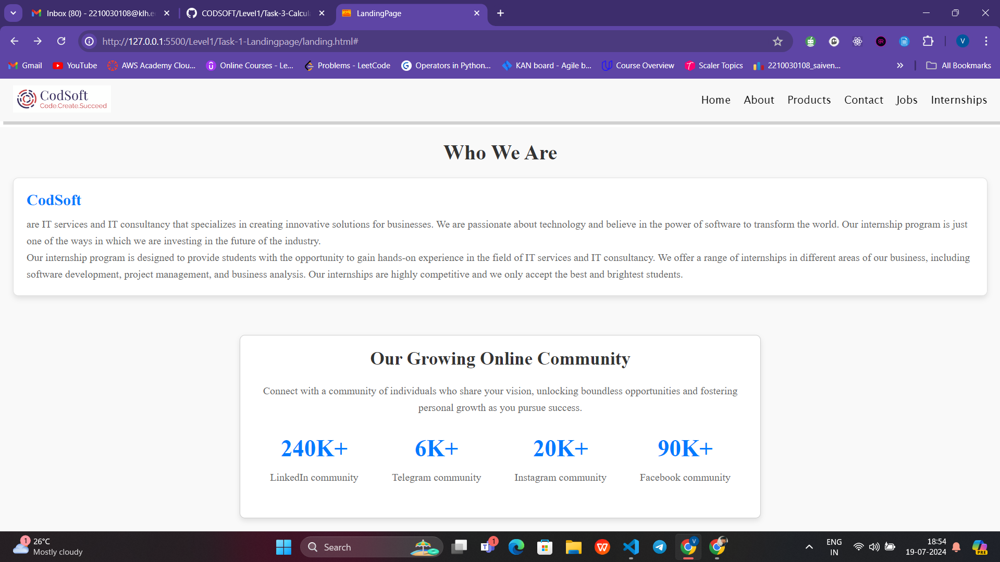
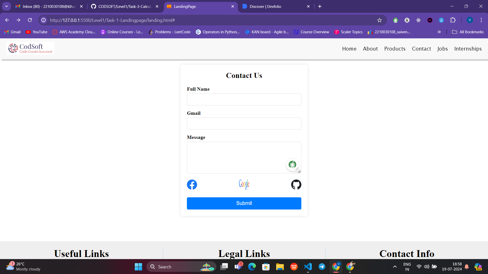
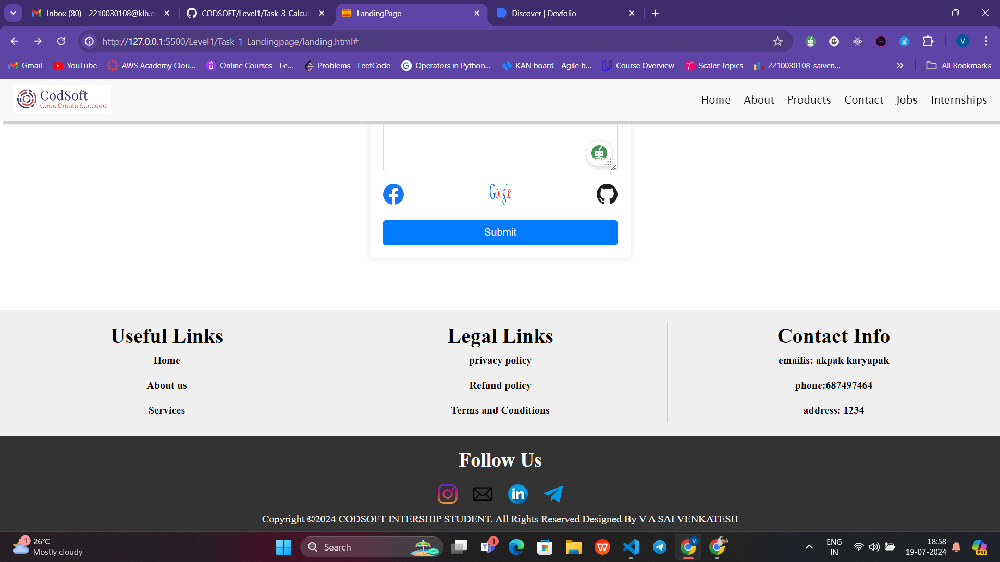

# Landing Page

Welcome to the Landing Page project! This README provides an overview of the features and structure of the landing page, including its various sections and functionalities.

## Overview

The landing page is designed to provide an engaging and visually appealing introduction to our brand and offerings. It includes a variety of sections, each serving a specific purpose to enhance the user experience.

## Features

1. **Header Navigation**
   - **Logo**: Displays the brand logo.
   - **Navigation Menu**: Links to different sections of the site including Home, About, Products, Contact, Jobs, and Internships.
   - **Responsive Menu**: A menu toggle button for smaller screens that reveals the navigation links.

2. **Hero Section**
   - **Full-Height Slider**: A visually striking image slider that takes up the full viewport height. It displays rotating images with smooth transitions and blur effects.
   - **Default Slide**: On page load, the first slide is displayed by default.

3. **About Us Section**
   - **Company Info**: Provides details about the company, including mission, vision, and values.

4. **Community Section**
   - **Community Stats**: Highlights key statistics and achievements with engaging visuals and descriptions.

5. **Internship Section**
   - **Internship Opportunities**: Displays available internship positions in a responsive grid layout.

6. **Services Section**
   - **Service Offerings**: Describes the services provided with images and brief descriptions.

7. **Contact Section**
   - **Contact Form**: Allows users to get in touch with us via a form. Includes fields for name, email, message, and social media links.

8. **Footer**
   - **Footer Links**: Provides links to additional resources and social media profiles.
   - **Contact Information**: Displays contact details and other relevant information.

## Image Slider

The image slider in the Hero section features a set of product photos. Each image is showcased with a smooth sliding effect and is blurred until it becomes the active slide. Below are the images used in the slider:

### Images
- **Slide 1**: 
- **Slide 2**: 
- **Slide 3**: 
- **Slide 4**: 
- **Slide 5**: 

## Usage

1. **Clone the Repository**:
   ```bash
   git clone https://github.com/yourusername/landing-page.git
Navigate to the Project Directory:

bash

cd landing-page

Open the index.html file in your browser to view the landing page.

