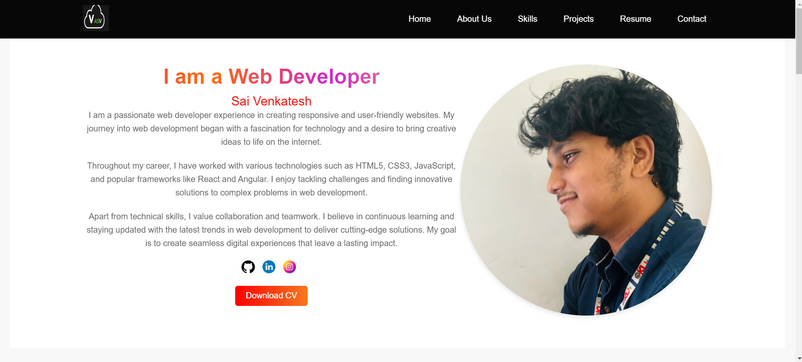

# Portfolio Website

Welcome to my portfolio website! This project showcases my skills in HTML, CSS, and JavaScript, featuring various sections such as About Us, Skills, Projects, Resume Page, and Contact Page. The website is designed to be responsive and includes smooth scrolling animations for a seamless user experience.

## Sections

### About Us

The "About Us" section introduces myself and provides a brief overview of my background, education, and career objectives.

### Skills

In the "Skills" section, I highlight my proficiency in various technologies and tools related to web development, including HTML5, CSS3, JavaScript, and frameworks such as Bootstrap.

### Projects

The "Projects" section displays a collection of projects that I have worked on. Each project includes a brief description, technologies used, and a link to view the project live or its source code on GitHub.

### Resume Page

The "Resume Page" provides visitors with access to my resume or CV. It includes information about my education, work experience, skills, and contact details.

### Contact Page

The "Contact Page" offers visitors a way to get in touch with me. It includes a contact form or provides details such as my email address and social media profiles for professional networking.

## Features

- **Responsive Design**: Ensures compatibility across devices and screen sizes.
- **Smooth Scrolling Animations**: Provides a polished and modern user interface.
- **Clean and Minimalistic Layout**: Focuses on showcasing content effectively.
- **Fixed Header Menu**: Enables easy navigation to different sections.
- **Interactive Elements**: Includes hover effects and clickable buttons to enhance user engagement.

## Technologies Used

- **HTML5**: Structure and content markup.
- **CSS3**: Styling and layout design, including responsive techniques.
- **JavaScript**: Client-side scripting for interactive features and animations.
- **Bootstrap**: Front-end framework for responsive and mobile-first design.
- **Smooth Scroll**: JavaScript library for smooth scrolling animations.
- **GitHub Pages**: Deployment platform for hosting the live website.

## Preview



Live Demo
Check out the live demo of my portfolio website here.
## Installation

To view the website locally, you can clone the repository and open `index.html` in your web browser:

```bash
git clone https://github.com/2210030108/CODSOFT.git
cd your-repository
Usage
Feel free to explore each section of the website to learn more about my skills, projects, and background. If you have any feedback or inquiries, don't hesitate to reach out through the contact page!
