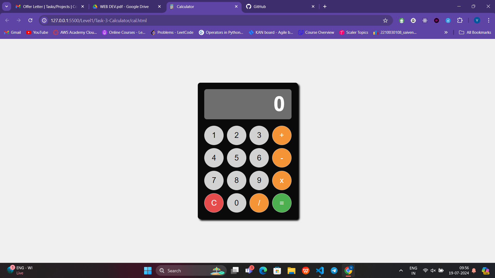

# Calculator Project

This project is a simple calculator application built using HTML, CSS, and JavaScript.

## Features

- Basic arithmetic operations (addition, subtraction, multiplication, division).
- Responsive design for various screen sizes.
- Clear button to reset the calculator.

## How to Run

To run this project locally using Visual Studio Code and its Live Server extension, follow these steps:

1. **Clone the repository** to your local machine:

   git clone https://github.com/2210030108/CODSOFT.git

Open the project in Visual Studio Code:

Launch VS Code Quick Open (Ctrl+P), paste the following command, and press enter:

ext install ritwickdey.LiveServer
Start the Live Server:

Open the index.html file.
Right-click anywhere in the HTML file and select Open with Live Server. Alternatively, use the shortcut Alt+L followed by Alt+O.
View the application:

Your default web browser should automatically open the calculator application.
If it doesn't, you can manually open a browser and go to http://localhost:5500/index.html.
Interact with the calculator:

Perform calculations by clicking the buttons on the calculator.

Use the clear button (C) to reset the calculator.

Technologies Used:-
HTML
CSS
JavaScript

Credits
This project was created as part of CODSOFT INTERNSHIP PROJECT.